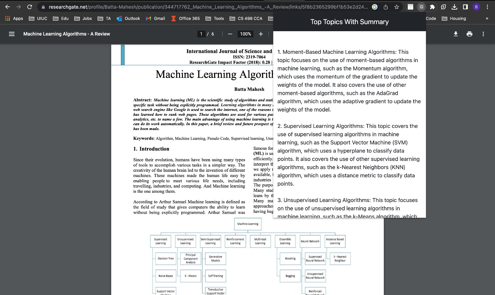
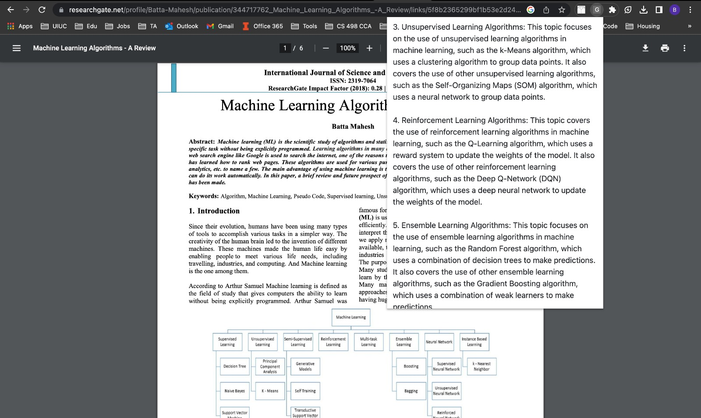
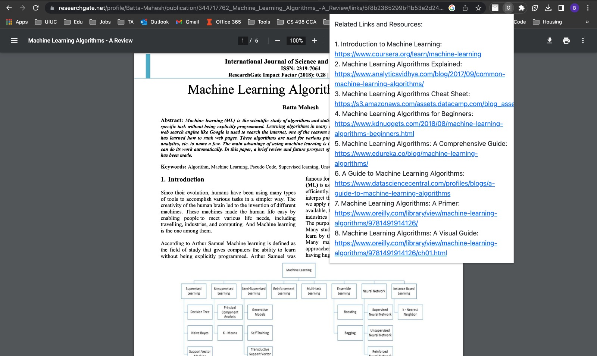

# Browser Extension for Topic wise summary generator
This repository contains the code and instructions for using the extension which can provide topics, their summaries and related resources for a webpage.

This code is for a browser extension which can provide topic wise summaries and related resources links for a web page

# Set up

## Backend

We provided two python files (app.py and lda.py) in the backend folder. You need to install required dependencies and then run app.py. You can run the backend on your own machine (we highly recommend to use virtual environments) or in the cloud (like AWS EC2). We tested the code on EC2 instance with Amazon Linux 2023 AMI. Similar setup should work on other linux based machines as well.

set up EC2 (or any other cloud server or your local machine in a virtual env)
sudo yum update -y
sudo yum install git -y
sudo yum install -y python3 python3-pip
git clone https://github.com/openai/openai-quickstart-python.git
cd openai-quickstart-python
cp .env.example .env
vi .env -> generate openAI secret key from https://platform.openai.com/account/api-keys and add it to .env file.
pip3 install -r requirements.txt
rm app.py
cat > app.py (copy the app.py code in this repo)
cat > lda.py (copy the lda.py code in this repo)
pip3 install flask_cors bs4 nltk gensim numpy
python3 app.py

## Extension

1. Download the extension folder. In the working.js file, add your backend server's ip address in the first line. For example: ```var domain = "http://107.23.133.88:8000"```
2. Open Google Chrome and type "chrome://extensions" in the address bar. This will take you to the Extensions page.
3. Enable Developer mode by toggling the switch on the top right corner of the page.
4. Click on the "Load unpacked" button that appears on the left-hand side of the page.
5. In the file explorer window that appears, navigate to the folder where your extension is located.
6. Select the folder and click "OK" to load your extension.

The extension should now appear on the Extensions page

# Test
You can now open any webpage which contains a lot of text like news articles, research papaers etc and click on the extension. After 15-20 seconds, you should see the topic wise summaries and related links.




